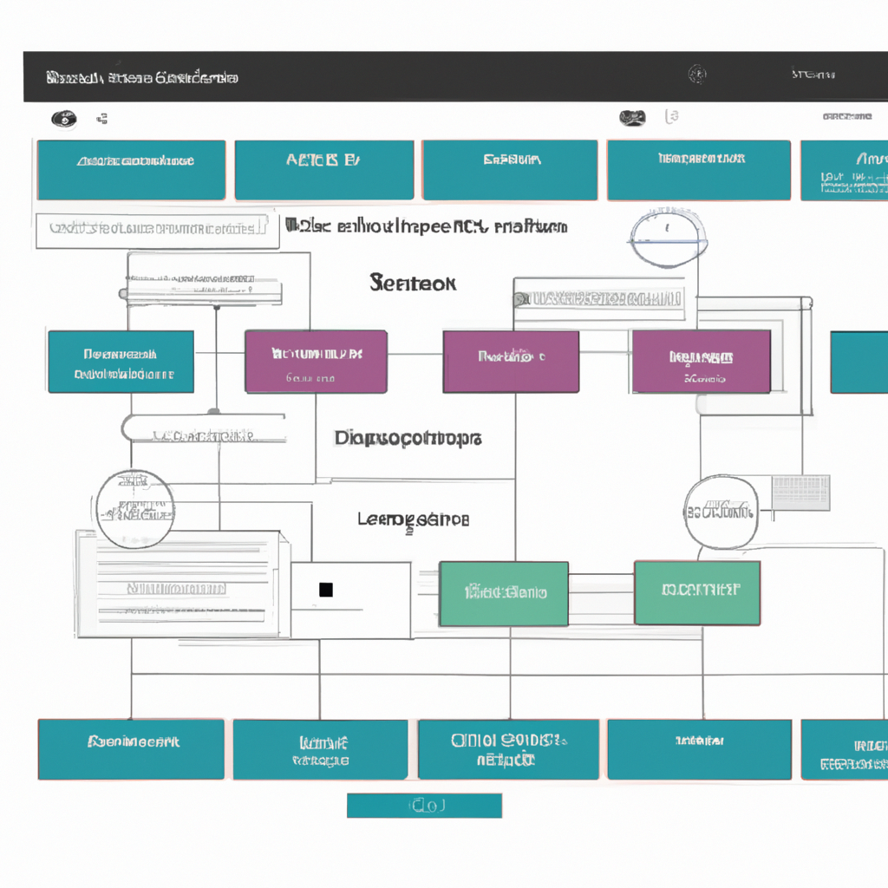
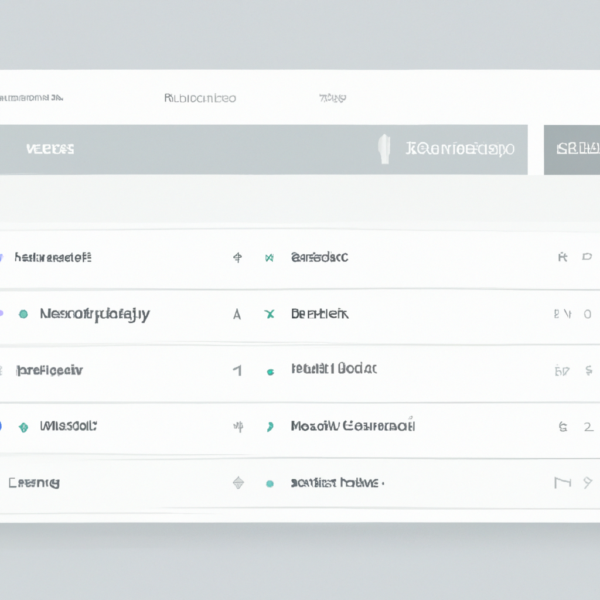

# 360T Knowledge Graph User Guide

## Introduction

The 360T Knowledge Graph provides a comprehensive visualization and querying tool for exploring relationships between various components of the 360T trading platform. This user guide is designed for end users who need to navigate, search, and extract information from the knowledge graph.

## Accessing the Knowledge Graph

### Web Interface

1. Open your web browser and navigate to `http://localhost:3002`
2. Enter your credentials in the login screen
   - Username: your corporate email address
   - Password: your system password
3. Upon successful login, you will be directed to the dashboard

### API Access

For programmatic access to the knowledge graph:
- Base URL: `http://localhost:3002/api`
- Authentication: JWT tokens (see [API Reference](./api-reference.md) for details)

## Dashboard Overview

The dashboard is divided into several key areas:

1. **Navigation Menu** (Left sidebar)
   - Home
   - Search
   - Visualizations
   - Reports
   - Favorites
   - Settings

2. **Main Content Area** (Center)
   - Displays search results, visualizations, and reports

3. **Filter Panel** (Right sidebar)
   - Refine search results and visualizations

4. **Command Bar** (Top)
   - Quick search
   - Create new items
   - Access help

## Basic Search

1. From the dashboard, click on the **Search** icon in the navigation menu
2. Enter your search terms in the search bar
3. Select the entity types to include in your search:
   - Modules
   - Products
   - Workflows
   - UI Areas
   - Configuration Items
   - Test Cases
4. Click the **Search** button
5. Results will display in the main content area with:
   - Entity name
   - Entity type
   - Last modified date
   - Relevance score

### Advanced Search Options

- **Boolean Operators**: Use AND, OR, NOT to create complex queries
- **Exact Phrases**: Use quotes around phrases ("market data module")
- **Field-Specific Search**: Use field:value format (type:module name:trading)
- **Wildcards**: Use * for multiple characters, ? for single character

## Visualization Features

### Creating a New Visualization

1. From the dashboard, click on **Visualizations** in the navigation menu
2. Click **New Visualization**
3. Select a visualization type:
   - Module Dependencies
   - Product Components
   - Test Coverage
   - UI Navigation Flow
   - Configuration Impact
4. Enter the starting node (e.g., module name)
5. Set the depth of relationships (1-3)
6. Click **Generate**

### Interacting with Visualizations

- **Zoom**: Use the mouse wheel or pinch gesture
- **Pan**: Click and drag in empty space
- **Select Nodes**: Click on a node to see details
- **Expand Node**: Double-click a node to expand its relationships
- **Hide Node**: Right-click and select "Hide"
- **Focus on Node**: Right-click and select "Focus"

### Customizing Visualizations

1. Click the **Style** button in the visualization toolbar
2. Customize:
   - Node colors (by type or property)
   - Node size (by importance or connections)
   - Relationship thickness
   - Labels visibility
   - Layout algorithm
3. Click **Apply** to update the visualization

### Saving and Sharing Visualizations

1. Click the **Save** button in the visualization toolbar
2. Enter a name and optional description
3. Choose visibility (Private or Shared)
4. Click **Save**
5. To share, click **Share** and:
   - Copy the direct link
   - Generate an export file
   - Schedule as a report

## Working with Reports

### Available Report Types

- **Module Dependency Analysis**: Shows dependencies between modules
- **Test Coverage Report**: Reveals which components have test coverage
- **Impact Analysis**: Displays the impact of changing a component
- **Configuration Traceability**: Maps configuration items to affected components

### Generating Reports

1. From the dashboard, click on **Reports** in the navigation menu
2. Select a report type
3. Configure report parameters
4. Click **Generate**
5. Reports can be:
   - Viewed in the browser
   - Downloaded as PDF, CSV, or JSON
   - Scheduled for regular generation

## Practical Use Cases

### Finding Related Components

1. Search for a specific module
2. From the search results, click on the module
3. In the module details view, click **View Relationships**
4. The visualization will show all components directly related to the module

### Assessing Change Impact

1. Navigate to **Visualizations**
2. Select **Configuration Impact**
3. Enter the name of the component being changed
4. Set depth to 2 or 3
5. The resulting visualization shows all components potentially affected by the change

### Identifying Test Coverage Gaps

1. Navigate to **Reports**
2. Select **Test Coverage Report**
3. Choose the product or module to analyze
4. Generate the report
5. Components without test coverage will be highlighted in red

## Data Export Options

The Knowledge Graph supports exporting data in various formats:

- **CSV**: Tabular data for spreadsheet analysis
- **JSON**: For programmatic processing
- **PNG/SVG**: For visualization graphics
- **PDF**: For formal reports and documentation

To export:
1. Generate the desired visualization or report
2. Click the **Export** button
3. Select the format
4. Choose export options (if applicable)
5. Click **Download**

## Favorites and Bookmarks

### Saving Items as Favorites

1. When viewing any search result, visualization, or report, click the **Star** icon
2. The item will be added to your favorites

### Accessing Favorites

1. Click on **Favorites** in the navigation menu
2. Your saved items will be listed by category
3. Click on any item to open it

## User Preferences

### Customizing the Interface

1. Click on **Settings** in the navigation menu
2. Navigate to the **Interface** tab
3. Customize:
   - Default visualization layout
   - Color theme
   - Results per page
   - Default search filters

### Setting Notification Preferences

1. In **Settings**, navigate to the **Notifications** tab
2. Configure:
   - Email notifications
   - In-app alerts
   - Scheduled reports

## Keyboard Shortcuts

| Action | Shortcut |
|--------|----------|
| New Search | Ctrl/Cmd + F |
| New Visualization | Ctrl/Cmd + V |
| Save | Ctrl/Cmd + S |
| Export | Ctrl/Cmd + E |
| Refresh | F5 |
| Help | F1 |
| Full Screen | F11 |

## Best Practices

1. **Start Specific**: Begin searches with specific components rather than broad queries
2. **Limit Visualization Depth**: Keep relationship depth to 2-3 levels for readable visualizations
3. **Use Filters**: Apply filters to focus on relevant information
4. **Save Important Views**: Bookmark frequently used visualizations and searches
5. **Export Key Findings**: Export important visualizations for documentation
6. **Use Advanced Search**: Learn the advanced search syntax for more precise results
7. **Combine Tools**: Use search, visualization, and reports together for comprehensive analysis

## Troubleshooting

### Common Issues

1. **Slow Visualization Rendering**
   - Reduce the depth of relationships
   - Filter for specific node types
   - Use a more efficient layout algorithm

2. **Search Returns Too Many Results**
   - Use more specific search terms
   - Apply additional filters
   - Use advanced search syntax

3. **Visualization Appears Cluttered**
   - Reduce the number of displayed relationships
   - Hide less relevant node types
   - Adjust the layout algorithm
   - Increase spacing between nodes

### Error Messages

| Error | Possible Solution |
|-------|-------------------|
| "No results found" | Check spelling or try broader search terms |
| "Visualization timeout" | Reduce query complexity or relationship depth |
| "Invalid query syntax" | Review search syntax for errors |
| "Authentication required" | Log in again as your session may have expired |

## Getting Additional Help

1. Click the **Help** button (?) in the top right corner of any screen
2. Use the built-in tutorial by clicking **Tutorials** in the Help menu
3. Contact support:
   - Technical Support: [support@360t.com](mailto:support@360t.com)
   - Usage Questions: [knowledge-graph@360t.com](mailto:knowledge-graph@360t.com)

## Related Documentation

- [Data Model Guide](./data-model.md): Understand the structure of the knowledge graph
- [API Reference](./api-reference.md): For programmatic access
- [Query Guide](./query-guide.md): Advanced querying techniques
- [Visualization Guide](./visualization.md): Detailed visualization options 