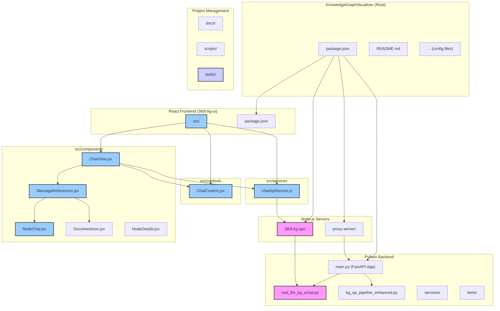

# Development Environment Setup

This document provides a comprehensive guide for setting up and working with the Knowledge Graph Visualizer development environment, including both the existing graph visualization features and the new chat functionality.

## Overview

The Knowledge Graph Visualizer consists of several services:

1. **React UI** (`360t-kg-ui/`) - Frontend interface for graph visualization and chat
2. **Node.js API** (`360t-kg-api/`) - Backend API server for graph operations
3. **Python Chat API** (future) - FastAPI service for chat functionality
4. **Neo4j Database** - Graph database for storing knowledge graph data

## Prerequisites

### Required Software

- **Node.js** v18.x or later
- **Python** v3.11 or later
- **Docker & Docker Compose** (for containerized development)
- **Git** for version control

### Recommended Tools

- **VS Code** with extensions:
  - ESLint
  - Prettier
  - Python
  - Docker
- **Neo4j Desktop** (optional, for database management)

## Environment Configuration

### Environment Variables

The project uses multiple environment files for different services:

#### Root `.env.example`
Contains shared configuration for development tools and AI services:

```env
# Required for AI/Chat functionality
ANTHROPIC_API_KEY=your-api-key-here
PERPLEXITY_API_KEY=pplx-abcde

# Model Configuration
MODEL=claude-3-7-sonnet-20250219
PERPLEXITY_MODEL=sonar-pro
MAX_TOKENS=64000
TEMPERATURE=0.2

# Development Settings
DEBUG=false
LOG_LEVEL=info
DEFAULT_SUBTASKS=5
DEFAULT_PRIORITY=medium
PROJECT_NAME=KnowledgeGraphVisualizer
```

#### API Service (`360t-kg-api/.env.example`)
Configuration for the Node.js API service:

```env
# Neo4j Configuration
NEO4J_URI=neo4j://localhost:7687
NEO4J_USERNAME=neo4j
NEO4J_PASSWORD=your_password_here

# Server Configuration
PORT=3002
```

#### UI Service (`360t-kg-ui/.env`)
Configuration for the React frontend:

```env
VITE_API_URL=http://localhost:3002/api
```

## Development Setup Options

### Option 1: Docker Development (Recommended)

1. **Clone and Setup**
   ```bash
   git clone <repository-url>
   cd KnowledgeGraphVisualizer
   cp .env.example .env
   # Edit .env with your API keys
   ```

2. **Start Services**
   ```bash
   docker-compose up -d
   ```

3. **Access Applications**
   - UI: http://localhost:5173
   - API: http://localhost:3002
   - Neo4j Browser: http://localhost:7474
   - Chat API (future): http://localhost:8000

### Option 2: Local Development

1. **Setup API Service**
   ```bash
   cd 360t-kg-api
   cp .env.example .env
   # Edit .env with your database credentials
   npm install
   npm run dev
   ```

2. **Setup UI Service**
   ```bash
   cd 360t-kg-ui
   npm install
   npm run dev
   ```

3. **Setup Python Environment**
   ```bash
   python -m venv .venv
   source .venv/bin/activate  # On Windows: .venv\Scripts\activate
   pip install -r requirements.txt
   ```

## Working with Existing Features

The existing graph visualization functionality includes:

### API Endpoints (Port 3002)

- `GET /api/health` - Health check
- `GET /api/metadata` - Graph metadata (node labels, relationship types)
- `GET /api/graph/*` - Graph data endpoints
- `GET /api/analysis/*` - Graph analysis endpoints
- `GET /api/docs/:filename` - Documentation files

### UI Components (`360t-kg-ui/src/`)

- **GraphView** - Main graph visualization component
- **SearchBar** - Node/relationship search functionality
- **Legend** - Graph legend and controls
- **NodeDetails** - Node information display
- **Header** - Application header and navigation

## Chat Feature Development

The new chat functionality will be built using:

### Architecture

```
React UI (Port 5173)
    ↓ API calls
Node.js Proxy (Port 3002)
    ↓ Forwards chat requests
Python FastAPI (Port 8000)
    ↓ Queries
Neo4j Database (Port 7687)
```

### Development Workflow for Chat Features

1. **Preserve Existing Functionality**
   - All existing graph visualization features must continue to work
   - Do not modify existing API endpoints without backward compatibility
   - New chat components should be separate from existing UI components

2. **API Development**
   - Chat endpoints will be defined in `api-contracts/chat-api.yaml`
   - Python FastAPI service will implement the chat logic
   - Node.js service will proxy chat requests to Python service

3. **UI Development**
   - New chat components will be added to `360t-kg-ui/src/components/`
   - Chat functionality will integrate with existing routing
   - Maintain consistent styling with existing components

## Testing Strategy

### Automated Testing

1. **API Tests**
   ```bash
   cd 360t-kg-api
   npm test
   ```

2. **UI Tests**
   ```bash
   cd 360t-kg-ui
   npm test
   ```

3. **Python Tests**
   ```bash
   pytest
   ```

### Integration Testing

- Test existing graph functionality works after chat feature additions
- Verify API contracts match implementation
- Test Docker environment setup

## Development Guidelines

### Code Style

- **JavaScript/React**: ESLint + Prettier configuration
- **Python**: Black formatter + flake8 linting
- **Git**: Conventional commit messages

### Adding New Features

1. **Plan Integration**
   - Ensure new features complement existing functionality
   - Update API contracts before implementation
   - Consider backward compatibility

2. **Implementation Order**
   - Define API contracts
   - Implement backend logic
   - Create frontend components
   - Add tests
   - Update documentation

3. **Testing Checklist**
   - [ ] Existing graph features still work
   - [ ] New functionality works as expected
   - [ ] API contracts match implementation
   - [ ] Docker environment works
   - [ ] Documentation is updated

## Troubleshooting

### Common Issues

1. **Port Conflicts**
   - Check if ports 3002, 5173, 7474, 7687, 8000 are available
   - Use `lsof -i :PORT` to check port usage

2. **Environment Variables**
   - Ensure all required API keys are set
   - Check .env files are properly configured
   - Verify Neo4j credentials

3. **Docker Issues**
   - Run `docker-compose down` before `docker-compose up`
   - Check Docker daemon is running
   - Verify sufficient disk space

### Log Locations

- API Service: Console output or `server.log`
- UI Service: Console output
- Neo4j: Docker logs or Neo4j logs directory
- Chat API: Console output when running

## Contributing

1. **Branch Naming**
   - `feature/chat-functionality`
   - `bugfix/graph-rendering-issue`
   - `docs/api-documentation`

2. **Pull Request Process**
   - Ensure all tests pass
   - Update documentation
   - Get code review
   - Verify existing functionality

3. **Code Review Checklist**
   - [ ] Follows established patterns
   - [ ] Includes appropriate tests
   - [ ] Updates documentation
   - [ ] Preserves existing functionality
   - [ ] Follows security best practices

## Support

For development questions or issues:

1. Check this documentation
2. Review existing code patterns
3. Check API contracts
4. Test in Docker environment
5. Create detailed issue report

## Project Architecture

This document provides a high-level overview of the KnowledgeGraphVisualizer project structure, including the backend, frontend, and supporting services.

### System Diagram

The following diagram illustrates the main components and their relationships. You can click on key files to open them directly.



### Component Breakdown

-   **Python Backend**: Contains the core logic for querying the knowledge graph (`real_llm_kg_script.py`), processing QA pipelines, and serving results via a FastAPI application (`main.py`).
-   **Node.js Servers**: Includes a proxy for managing requests and the primary `360t-kg-api` which communicates between the frontend and the Python backend.
-   **React Frontend**: The `360t-kg-ui` application, which contains all user-facing components, services for API communication, and state management via React Context.
-   **Project Management**: Directories for documentation (`docs/`), automation scripts (`scripts/`), and task tracking (`tasks/`).

This structure separates concerns, allowing the backend to focus on data processing while the frontend handles presentation and user interaction. 